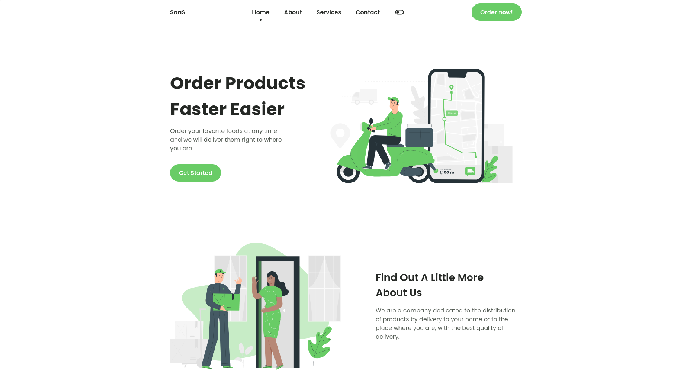

<h1 align="center"> SaaS Landing Page Template </h1>

<p align="center">
  
  
  
  
  
  
  
</p>

<p align="center">
  <a href="#-technologies">Technologies</a>&nbsp;&nbsp;&nbsp;|&nbsp;&nbsp;&nbsp;
  <a href="#-project">Project</a>&nbsp;&nbsp;&nbsp;|&nbsp;&nbsp;&nbsp;
  <a href="#-layout">Layout</a>&nbsp;&nbsp;&nbsp;|&nbsp;&nbsp;&nbsp;
  <a href="#memo-licença">Licença</a>
</p>

<p align="center">
  
</p>

<br>

<p align="center">
  
</p>

## 🚀 Technologies

This project was developed with the following technologies:

- HTML e CSS
- JavaScript
- Git e Github
- Figma

## 💻 Project

This repository offers a sleek, multi-purpose SaaS landing page template. Fully responsive and designed with HTML, CSS, and JavaScript to serve as a solid foundation for any software-as-a-service venture.

## 💻 How to run

```bash
# Clone the repository
git clone https://github.com/filipebteixeira98/saas-platform.git

# Access the project folder
cd saas-platform

# Open the index.html file in your browser
open index.html
```

## 📝 License

This project is under the MIT license.

<p align="center">
  Made with ♥ by me
</p>
